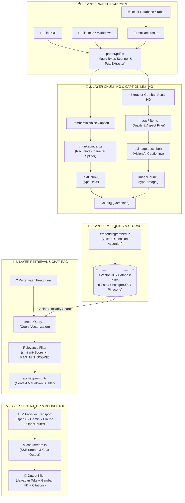

# 🏛️ ARSITEKTUR.md — Arsitektur Sistem `@badriana/ai-core`

Document Version: **1.0.0**  
Package Name: **`@badriana/ai-core`**  
Target Standard: **Enterprise Multimodal RAG Engine (GPT-4o / Gemini / Claude Standard)**

---

## 📌 1. Gambaran Umum & Prinsip Desain (System Overview)

**`@badriana/ai-core`** dirancang sebagai Framework SDK RAG Multimodal berkinerja tinggi. Sistem ini mengadopsi 4 prinsip arsitektur modern:

1. **Layout-Aware Document Parsing**: PDF/Teks tidak dibaca sebagai string kaku, melainkan diekstrak menjadi elemen terstruktur (Teks Narasi, Gambar Visual HD, Tabel, dan Caption).
2. **Element-Based Chunking**: Memisahkan potongan pengetahuan menjadi `TextChunk` (`type: 'text'`) dan `ImageChunk` (`type: 'image'`) mandiri yang masing-masing memiliki UUID dan Vektor Embedding 1536-D.
3. **Hybrid Vector Retrieval**: Mengombinasikan pencarian kemiripan sudut (*Cosine Similarity*) dengan filter metadata halaman & pencocokan kata kunci.
4. **Zero Synthetic Fabrication**: Menjamin 100% kejujuran data — tidak ada gambar sintetis buatan (SVG palsu) atau tebakan kata kunci palsu.

---

## 📐 2. Diagram Arsitektur End-to-End (System Blueprint)



---

## 🗂️ 3. Arsitektur Struktur Modul (Module Architecture)

Repository `D:\badri\npm\ai-core\src` terbagi menjadi modul-modul independen yang bersih (*Decoupled Architecture*):

```text
src/
├── ai/                      # Kapabilitas AI High-Level
│   ├── audio/               # Modul Audio (speakAudio, transcribeAudio)
│   ├── chat/                # Modul Chat (generate, stream, prompt, citations)
│   ├── context/             # Modul Context Builder (Markdown / XML Converter)
│   ├── document/            # Modul Document Namespace (parse, chunk, create)
│   ├── embedding/           # Modul Embedding Namespace (create, batch)
│   ├── image/               # Modul Vision & Image Processor (describe, ocr)
│   ├── query/               # Modul Query Vector Builder
│   └── utils/               # Modul Utility (countTokens, cleanMarkdown, cost)
├── chunker/                 # Engine Pemotong Teks Semantik (Recursive Splitter)
├── client/                  # Transport, Config, & Context Manager Client
├── embedding/               # Engine Embedding & Validasi Konsistensi Vektor
├── errors/                  # Custom Error System (RagError, EmptyDocumentError)
├── parser/                  # PDF & Text Parser Engine (Magic Bytes Scanner)
├── utils/                   # Image Filter & Heuristik Kualitas Gambar
├── createDocument.ts        # Pipeline Utama Ingesti Dokumen
├── createQuery.ts           # Pipeline Utama Pencarian RAG
└── index.ts                 # Main Export Entry Point Package
```

---

## 📊 4. Skema Data & Interface Model (Data Schema)

### A. Objek Chunk Teks (`TextChunk`)
```typescript
interface TextChunk {
  id: string;                // UUID Vektor Chunk
  type: 'text';              // Tipe Chunk Teks
  index: number;             // Posisi Urutan di Dokumen (0, 1, 2...)
  startOffset: number;       // Karakter awal di dokumen
  endOffset: number;         // Karakter akhir di dokumen
  content: string;           // Teks Paragraf Pengetahuan
  embedding: readonly number[]; // Vektor 1536-D
  source: ChunkSource;       // Metadata Sumber File
}
```

### B. Objek Chunk Gambar (`ImageChunk`)
```typescript
interface ImageChunk {
  id: string;                // UUID Vektor Chunk Gambar (mis. eec9d9b0-...)
  type: 'image';             // Tipe Chunk Gambar
  kind?: ImageKind;          // 'diagram' | 'photo' | 'chart' | 'table'
  index: number;             // Posisi Urutan di Dokumen
  content: string;           // Deskripsi Visual buatan Vision AI + Context Caption
  embedding: readonly number[]; // Vektor 1536-D dari Deskripsi Gambar
  image: ImageData;          // Base64 Data URI, MIME Type, & Page Number
  metadata: {
    title?: string;
    caption?: string;
    page?: number;           // Halaman PDF Asal Gambar
  };
}
```

---

## 🔍 5. Alur Pencarian RAG & Hybrid Retrieval (Query Flow)

```
1. Input User: "Tampilkan gambar diagram Hukum Newton 1"
   │
   ├──► 2. Query Embedding (embedQuery) ➔ Vektor Query (1536-D)
   │
   ├──► 3. Cosine Similarity Engine ➔ Menghitung Skor Kemiripan Vektor di DB
   │
   ├──► 4. Filter Ambang Skor (Score Thresholding) ➔ Hanya mengambil skor >= 0.15
   │
   ├──► 5. Format Matching (Teks vs Gambar):
   │       - Chunks Teks   ➔ Dirangkai ke Context Markdown untuk LLM
   │       - Chunks Gambar ➔ Dipetakan ke Array `images[]` (URL Cloudinary HD + Page)
   │
   └──► 6. LLM Output ➔ Menghasilkan Jawaban Teks Presisi + Komponen Gambar HD
```

---

## 🛡️ 6. Panduan Produksi & Manajemen Memori (Production Guidelines)

1. **Pengaturan Environment Variables**:
   ```env
   OPENROUTER_API_KEY=sk-or-v1-...
   RAG_MIN_SCORE=0.15
   AI_DESCRIBE_IMAGES=true
   ```
2. **Manajemen Memori Node.js**:
   - Pemrosesan file PDF raksasa (500+ halaman) memanfaatkan streaming biner untuk mencegah *Out-Of-Memory (OOM)*.
3. **Provider Failover**:
   - Jika provider utama offline, `transport.ts` secara otomatis melakukan *retry* dengan eksponensial backoff.

---
*Dokumentasi Arsitektur Resmi `@badriana/ai-core`*
